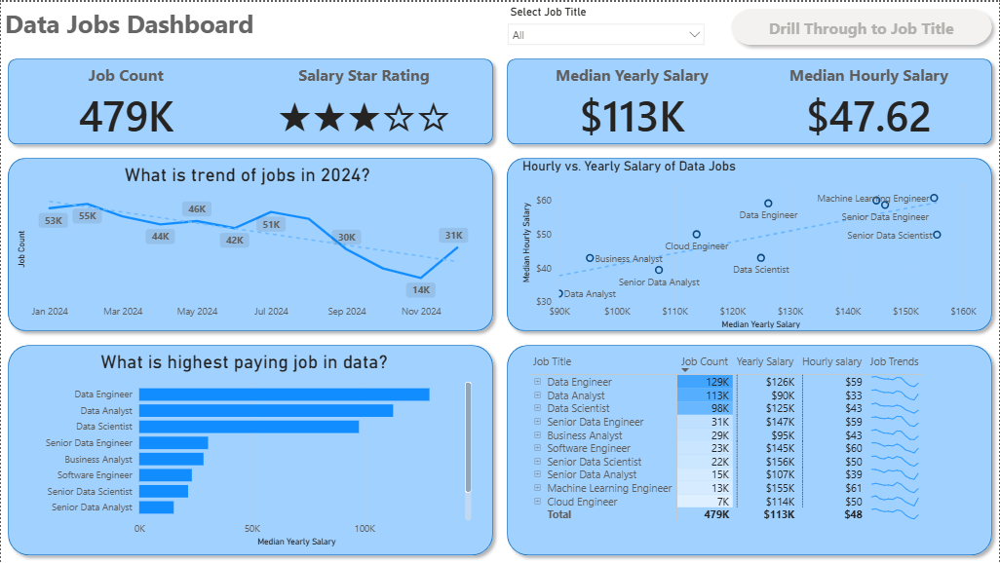
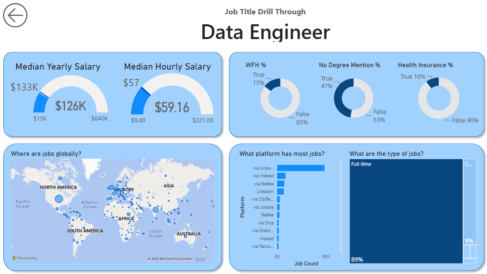

# Data Jobs Dashboard

An interactive Power BI report for exploring the 2024 data-job market. The dashboard helps users compare job-posting volume, salary, location, work arrangements, degree mentions, benefits, employment schedules, and job-posting sources across data-related roles.

## Business Problem

Data-job postings contain useful information about demand, compensation, location, and job requirements, but hundreds of thousands of individual listings are difficult to compare manually.
This project turns the raw job-postings data into an interactive report so users can move from a broad market view to a focused analysis of a selected job title.

## Business Questions

The dashboard was designed to explore the following questions:
- Which data-related roles have the highest job-posting volume?
- How do yearly and hourly salary levels differ across job titles?
- How does job-posting activity change over time?
- Which countries and locations have the greatest posting presence?
- How common is work-from-home availability across roles?
- How frequently do job postings mention a degree?
- How frequently do postings include health-insurance information?
- Which job-posting sources contain the most job listings?
- How do the characteristics of one selected role compare with the wider market?


## Dataset

The report uses `job_postings_flat.csv`, a dataset containing **478,895 job-posting records** covering **2024**. It includes 10 standardized job-title categories and information about locations, salaries, schedules, companies, skills, and job-posting sources.
Important fields used in the report include:

| Field | Description |
| --- | --- |
| `job_title_short` | Standardized job-title category |
| `job_location` | Location of the job |
| `job_via` | Job-posting source or platform |
| `job_schedule_type` | Employment schedule |
| `job_work_from_home` | Work-from-home indicator |
| `job_posted_date` | Date the job was posted |
| `job_no_degree_mention` | Whether a degree is not mentioned |
| `job_health_insurance` | Health-insurance indicator |
| `job_country` | Country of the job |
| `salary_year_avg` | Annual salary where available |
| `salary_hour_avg` | Hourly salary where available |

Salary information is missing for many postings. Salary analysis therefore applies only to records containing the relevant salary value.

**Note**: The original dataset is provided as a compressed ZIP file because the uncompressed CSV exceeds GitHub's 100 MB file-size limit. Extract `Data/job_postings_flat.zip` before opening or refreshing the Power BI report.


## Power BI Report
The PBIX file contains two report pages.

### 1. Data Jobs Dashboard
The main page provides a market-level overview with:
- A **Select Job Title** slicer
- Job count
- Median yearly salary
- Median hourly salary
- Salary star rating
- Job-posting trends over time
- Job count by job title
- Salary comparison across job titles
- A summary table containing job, salary, and trend metrics
- Access to job-title drill-through

### 2. Job Title Drill Through
The drill-through page provides a detailed view for a selected job title. It includes:
- Average and median yearly salary
- Average and median hourly salary
- Work-from-home availability
- Degree-mention status
- Health-insurance information
- Geographic distribution by country
- Employment schedule type
- Job-posting source

## Dashboard Preview
### Main Dashboard


### Job Title Drill Through


### Dashboard Flow
```text
Market Overview
      ↓
Select a Job Title
      ↓
Compare Role Metrics
      ↓
Drill Through
      ↓
Review Detailed Job Characteristics
```

## How to Use the Report
1. Extract `Data/job_postings_flat.zip`.
2. Ensure the extracted file is named `job_postings_flat.csv` and placed inside the Data folder.
3. Open `Data_Jobs_Dashboard.pbix` in Power BI Desktop.
4. If required, update the data source path to the extracted CSV.
5. Refresh the report.
6. Use **Select Job Title** to filter the overview page.
7. Compare job volume, salary, trends, and other role-level metrics.
8. Use drill-through to open the detailed page for the selected job title.

## Skills Demonstrated
- Loading and preparing data with Power Query
- Handling data types and missing values
- Creating Power BI measures with DAX
- Calculating job counts and salary metrics
- Building KPI cards, bar charts, line charts, scatter charts, maps, tables, donut charts, and treemaps
- Using slicers, filters, drill-through, and dashboard navigation

## Tools and Technologies
- Microsoft Power BI
- Power Query
- DAX
- CSV
- Interactive data visualization

## Project Structure
```text
Data-Jobs-Dashboard/
│
├── README.md
│
├── Data_Jobs_Dashboard.pbix
│
├── Data/
│   ├── job_postings_flat.zip
│   └── job_postings_flat.csv      # Created after extraction
│ 
└── images/
    ├── dashboard-overview.png
    └── job-title-drill-through.png
```

## Limitations
- The dataset represents job postings, not confirmed hires or employment outcomes.
- Job-posting counts should not be interpreted as the exact number of unique vacancies.
- Salary information is unavailable for many postings, so salary comparisons use only available salary records.
- Salary values depend on the information supplied in individual postings.
- “No degree mentioned” does not mean that a degree is not required.
- Work-from-home and health-insurance indicators depend on information included in the postings.
- The dataset covers 2024 and does not represent the current job market.
- The analysis is descriptive; it does not predict hiring outcomes or employment probabilities.

## Attribution
This project was developed while following **Luke Barousse’s Power BI tutorial**. It is included in my portfolio as a demonstration of data preparation, DAX measures, interactive reporting, visualization, filtering, and drill-through analysis.

## Conclusion
This project demonstrates how Power BI can transform a large job-postings dataset into an interactive dashboard for exploring the data-job market. It combines job demand, salary, location, remote-work availability, degree mentions, benefits, employment schedules, and job-posting sources, allowing users to move from a market-level overview to a detailed analysis of individual job roles.